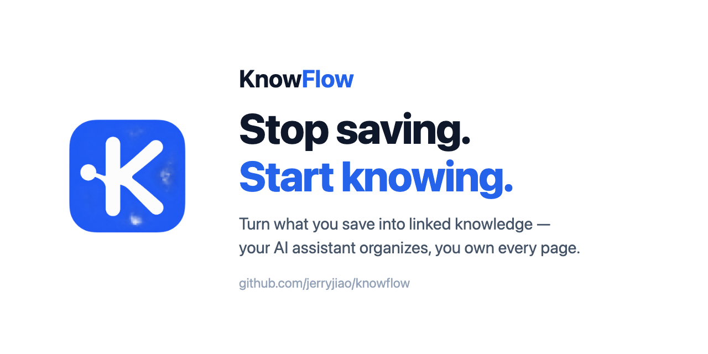
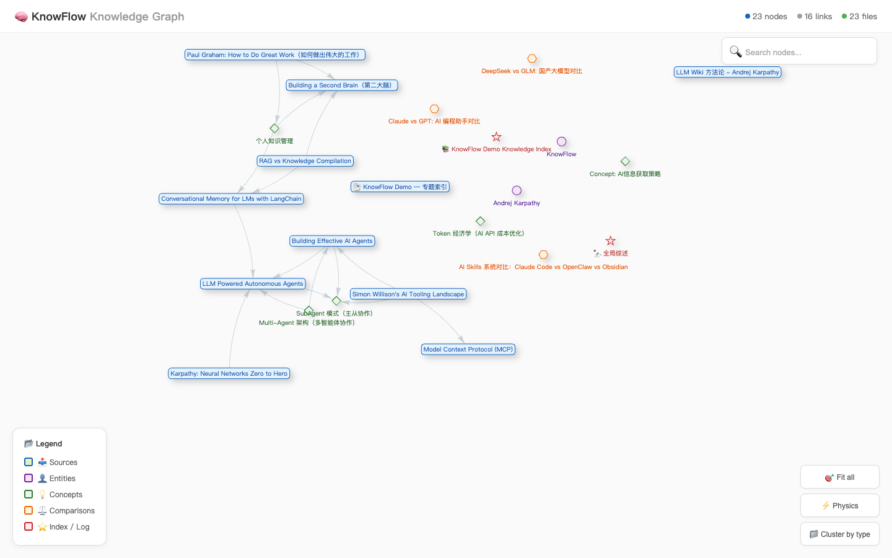

# KnowFlow

<p align="left"></p>

[English](README.md) | [简体中文](README.zh-CN.md) | [官网与文档](https://jerryjiao.github.io/knowflow/)

[](https://github.com/jerryjiao/knowflow/actions/workflows/ci.yml)
[](https://nodejs.org/)
[](LICENSE)



> 一个面向 AI Agent 的 Markdown 知识工作区：采集来源、整理互联 Wiki，并看见知识之间的关系。

KnowFlow 让整个流程保持透明、可检查：URL 和笔记先进入 `raw/`，再由你或 AI Agent 整理为结构化 Markdown 页面；本地工具负责生成知识图谱、检查 Wiki 健康度和显示项目状态。配置嵌入 API Key 后，还可启用语义检索。

- **知识层归你所有** — 使用普通 Markdown、可编辑模板和 `[[wikilinks]]`，不被封闭数据库锁定。
- **适配任意 Agent** — 采集保持确定性，知识提炼则交给你信任的 Agent 或工作流。
- **看见结构，而不只是搜索结果** — 生成交互式图谱，并发现断链和孤立页面。

> **Demo：** [运行从文本到图谱的完整演示](examples/quickstart.md)，然后在浏览器中探索生成的图谱。



## 快速开始

需要 Node.js 18+、Python 3.10+、Bash 和 curl。

npm 包尚未发布，先从源码安装（[详见下文](#从源码安装)）：

```bash
git clone https://github.com/jerryjiao/knowflow.git
cd knowflow
npm install && npm link
knowflow init my-wiki
cd my-wiki
knowflow ingest "LLM Wiki 把零散笔记整理成互联知识。" --source text
knowflow status
knowflow graph --no-open
```

这会创建一个独立项目、在 `raw/` 采集一条笔记，并根据初始 Wiki 生成图谱。**`ingest` 不会自动生成结构化 Wiki 页面。** 请先手动或通过 AI Agent / 自定义工作流整理原始素材，再重新生成图谱。

包发布到 npm 后，`npx knowflow@latest <命令>` 即可直接使用。

## 工作流

```text
URL 或笔记
    │
    ▼
raw/ Markdown ──► 你、AI Agent 或自定义工作流
                         │
                         ▼
                   互联 Wiki 页面
                    │         │
                    ▼         ▼
                 知识图谱    可选语义检索
```

KnowFlow 的灵感来自 [Andrej Karpathy 的 LLM Wiki](https://karpathy.github.io/llm-wiki/)：知识经过整理，成为持久、互联的页面，才会比一堆从未再打开的收藏更有价值。

## 已包含的能力

- 将纯文本和支持的 URL 采集为原始 Markdown。
- 使用 JSON 配置和可编辑页面模板初始化可移植项目。
- 通过 `[[wikilinks]]` 组织来源、实体、概念和对比页面。
- 无需 API Key 即可生成 `graph.html` 和 `graph.json`。
- 检查断链、过小文件和孤立页面。
- 配置智谱 AI 嵌入后，查询已构建的向量索引。

## 命令

| 命令 | 作用 |
| --- | --- |
| `knowflow init [directory]` | 创建独立项目，默认使用当前目录 |
| `knowflow ingest <url-or-text>` | 将 URL 或文本采集到 `raw/` |
| `knowflow graph [--no-open]` | 根据 Wiki 页面生成 `graph.html` 和 `graph.json` |
| `knowflow fix [--dry-run]` | 修复空链接、缺失页面、过小文件和孤儿页 |
| `knowflow health` | 检查断链、小文件和孤立页面 |
| `knowflow tags` | 根据 `[[tag/<名称>]]` 链接生成 `tag/<名称>.md` 聚合页 |
| `knowflow status` | 显示原始素材、Wiki、图谱、向量索引和 API Key 状态 |
| `knowflow query <text>` | 查询已有向量索引 |

KnowFlow 会从当前目录向上查找最近的 `.knowflowrc`，因此也可以在项目子目录中运行命令。

## 从源码安装

```bash
git clone https://github.com/jerryjiao/knowflow.git
cd knowflow
npm install
npm link
knowflow init ../my-wiki
```

再次运行 `init` 会保留已有配置、初始首页和已经自定义的模板。

## 项目目录

```text
my-wiki/
├── .knowflowrc
├── raw/                 # 采集的原始素材
├── wiki/
│   ├── index.md
│   ├── sources/
│   ├── entities/
│   ├── concepts/
│   └── comparisons/
├── graph/               # 生成的 graph.html 和 graph.json
└── templates/           # 可编辑 Markdown 模板
```

## 配置

`knowflow init` 会创建 JSON 格式的 `.knowflowrc`，所有相对路径都以该文件所在目录为基准解析。

```json
{
  "wiki": {
    "root": "./wiki",
    "rawDir": "./raw"
  },
  "graph": {
    "output": "./graph/graph.html"
  },
  "health": {
    "minFileSize": 100,
    "excludeOrphanDirs": ["sources/"]
  }
}
```

`health.excludeOrphanDirs` 列出预期不会被引用的目录（每日同步流水页、收件箱等），其中的页面不计入孤立页面。`knowflow tags` 每次都会全量重建 `wiki/tag/` 下的聚合页，新增带标签页面后重跑即可，幂等安全。

图谱生成、健康检查、内容采集和状态查看均不需要 API Key。语义检索需要在项目环境变量或项目根目录 `.env` 中设置 `ZHIPUAI_API_KEY`：

```bash
ZHIPUAI_API_KEY=your-key-here
```

当前 CLI 可以查询已有向量索引，但尚未提供独立的 `index` 命令。依赖搜索功能前，请先阅读[当前限制](#当前限制)。

## 当前限制

- `ingest` 只采集原始素材；将其提炼为结构化 Wiki 是独立的人工或 Agent 步骤。
- URL 采集依赖 Jina Reader；YouTube 和部分需要登录的平台可能还需要 `yt-dlp` 或带登录态的浏览器工作流。
- `query` 需要预先构建的向量索引和[智谱 AI API Key](https://open.bigmodel.cn/)。在加入 `index` 命令前，高级用户可运行 `node <knowflow-install>/scripts/vector-store.mjs build`。
- `bookmark_sync.sh` 依赖可选的第三方 `ft` 命令。
- 生成的图谱 HTML 打开时会从 CDN 加载 vis-network。

## 路线图

- [x] 独立项目初始化和可移植路径
- [x] URL / 文本原始采集、Wiki 健康检查和交互式图谱
- [x] CLI 自动化测试与多 Node.js 版本 CI
- [ ] 从原始素材到已审核 Wiki 页面的一等 Agent 工作流
- [ ] 增量采集和重复来源检测
- [ ] `knowflow index` 与可插拔嵌入提供商
- [ ] 提取器 / 插件系统和本地 Web UI

欢迎提交想法和范围清晰的 PR。你可以先阅读[贡献指南](CONTRIBUTING.md)、运行[从文本到图谱的示例](examples/quickstart.md)，或在 [GitHub Issues](https://github.com/jerryjiao/knowflow/issues) 中提出使用场景。

## 开发

```bash
npm install
npm run check
npm test
npm pack --dry-run
```

版本变化见[更新日志](CHANGELOG.md)，漏洞披露方式见[安全策略](SECURITY.md)。

## 许可证

[MIT](LICENSE) © [Jerry Jiao](https://github.com/jerryjiao)
